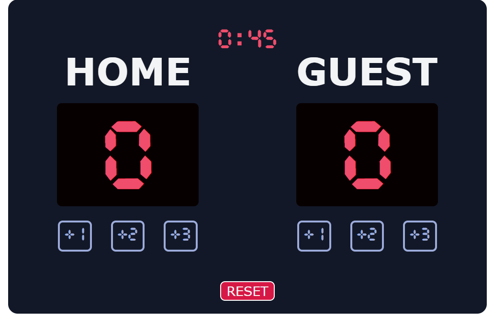

# Basketball Score Counter ⏱️ 🏀



A simple and interactive basketball score counter application built with vanilla JavaScript. This project features a live timer and score tracking functionality, making it perfect for practicing basketball games or training sessions.

## Features

- Real-time score tracking for both teams
- Live game timer
- Responsive design
- Easy-to-use interface
- Score increment buttons (+1, +2, +3 points)

## Technologies Used

- HTML5
- CSS3
- JavaScript (Vanilla)


## Installation

To run this project locally:

1. Clone the repository
   ```bash
   git clone https://github.com/skibsthebear/basketball-score-counter.git
   ```
2. Navigate to the project directory
   ```bash
   cd basketball-score-counter
   ```
3. Open `index.html` in your preferred browser

## Usage

1. Click the "Start Game" button to begin the timer
2. Use the +1, +2, or +3 buttons to add points to each team's score
3. Reset the game at any time using the "New Game" button

## Contributing

Pull requests are welcome. For major changes, please open an issue first to discuss what you would like to change.

## License

[MIT](https://choosealicense.com/licenses/mit/)

## Acknowledgments

- Built as a JavaScript practice project
- Inspired by real basketball scorekeeping systems
